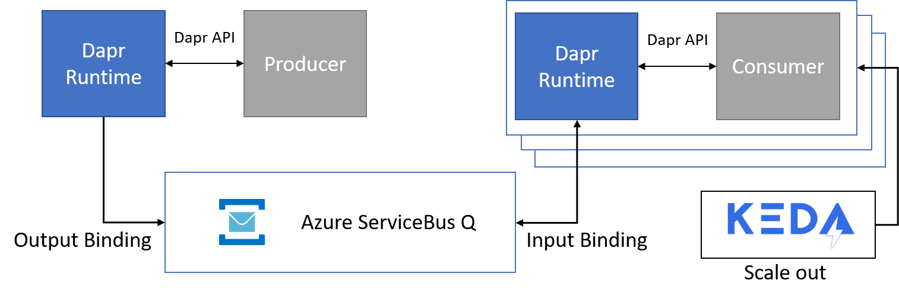

# Producer Consumer pattern with scalable consumer using dapr, keda and Azure ServiceBus Queues

I think every architect or developer knows about the producer consumer pattern. In this repository I want to show how [dapr bindings](http://github.com/dapr) can be used to implement this pattern and how the consumer can be scaled out with [keda](https://github.com/kedacore/keda).



In dapr you can use output and input bindings to send message to and receive messages from a queue. 
When you decide on a queue technique like Redis, RabbitMQ or Azure ServiceBus Queues, you usually have to use integration libraries for binding in your code.
With dapr you can integrate input and output bindings on a higher abstraction level and you don't need to know how the integration library works. 

In this sample we create two microservices, one with an input binding, the __Consumer__, and one with an output binding, the __Producer__. We will bind to Azure ServiceBus Queues and scale out the __Consumer__ on demand depending on how many messages are in the instance of a Azure ServiceBus Queue. We will use [keda](https://github.com/kedacore/keda) to provide scaling metrics for the Horizontal Pod Austoscaler. 

The __Producer__ and __Consumer__ are implemented already in Asp.NET Core 3.1. The application code is avalaible as a docker image on my Docker Hub repository:
- Producer: m009/producer:0.1
- Consumer: m009/consumer:0.1

## Prerequisites
- [Dapr enabled Kubernetes Cluster](https://github.com/dapr/docs/blob/master/getting-started/environment-setup.md#installing-dapr-on-a-kubernetes-cluster)
- [Keda enabled Kubernetes Cluster](https://keda.sh/deploy/)

## Run the application

### Setting up Azure ServiceBus Queue
1. Create a new or use an existing Azure ResourceGroup
   ```Shell
   az group create -n <your RG name> -l <location>
   ```
2. Create a new ServiceBus Namespace
   ```
   az servicebus namespace create -n <namespace name> -g <your RG name> -l <location> --sku Basic
   ```
3. We need to be able to manage the namespace, therefore we need to list the __RootManageSharedAccessKey__ connection string
   ```Shell
   az servicebus namespace authorization-rule keys list -g <your RG name> --namespace-name <namespace name> --name RootManageSharedAccessKey
   ```
   The output looks as follow:
   ```JSON
   {
     "aliasPrimaryConnectionString": null,
     "aliasSecondaryConnectionString": null,
     "keyName": "RootManageSharedAccessKey",
     "primaryConnectionString": "<connstr1>",
     "primaryKey": "<redacted>",
     "secondaryConnectionString": "<connstr2>",
     "secondaryKey": "<redacted>"
   }
   ```
   Create a base64 representation of the connection string (either use primary or secondary)
   ```Shell
   echo -n '<connstr1>' | base64
   ```
   Update the Kubernetes secret in [binding-deployment.yaml](deploy/binding-deployment.yaml) with the base64 encoded value.

4. Create a ServiceBus Queue
   ```
   az servicebus queue create -n msgqueue -g <your RG name> --namespace-name <namespace name>
   ```

5. We need to be able to connect to the queue, therefore we need to create an auth rule with __Manage__ permission
   ```Shell
   az servicebus queue authorization-rule create -g <your RG name> --namespace-name <namespace name> --queue-name msgqueue --name manage --rights Manage
   ``` 
   Once the auth rule is created we can list the connection string as follow:
   ```
   az servicebus queue authorization-rule keys list -g <your RG name> --namespace-name <namespace-name> --queue msgqueue --name manage
   ```
   The output looks as follow:
   ```JSON
   {
     "aliasPrimaryConnectionString": null,
     "aliasSecondaryConnectionString": null,
     "keyName": "order-consumer",
     "primaryConnectionString": "<connstr1>",
     "primaryKey": "<redacted>",
     "secondaryConnectionString": "<connstr2>",
     "secondaryKey": "<redacted>"
   }
   ```
   Create a base64 representation of the connection string (either use primary or secondary)
   ```Shell
   echo -n '<connstr1>' | base64
   ```
   Update the Kubernetes secret in [consumer-scaling.yaml](deploy/consumer-scaling.yaml) with the base64 encoded value.

### Kubernetes deployment

1. Deploy the Dapr binding to your cluster:
   ```Shell
   kubectl apply -f binding-deployment.yaml
   ```
2. Deploy the __Consumer__ to your cluster:
   ```
   kubectl apply -f consumer-deployment.yaml
   ```
3. Check the daprd sidecar for errors:
   ```Shell
   kubectl logs -l app=consumer -c daprd
   ```
   You should see that the sidecar has loaded the __Component__ __message-queue__ successfully
   ```Shell
   ...
   time="2019-12-24T14:27:24Z" level=info msg="loaded component message-queue (bindings.azure.servicebusqueues)"
   ...
   ```
4. Deploy the __Producer__ to your cluster:
   ```
   kubectl apply -f producer-deployment.yaml
   ```

### See it in action

1. Get the public ip of the producer service:
   ```
   kubectl get service
   ```
2. Open another shell and watch the logs of the consumer:
   ```
   kubectl logs -f -l app=consumer -c consumer
   ```
3. Now invoke the REST endpoint of the __Producer__ and set parameters as following:
   ```JSON
   {
     "count": 1
     "intervalMilliseconds": 0
   }
   ```
   You can either browse the Swagger UI that is published through the public endpoint or you just can use __curl__ to invoke the endpoint. With the above parameters we create just one message to test if everything is working. Watch the logs of the __Consumer__ in the other shell.
   ```Shell
   curl -X POST "http://<public ip>/MessageProducer" -H "accept: */*" -H "Content-Type: application/json" -d "{\"count\":1,\"intervalMilliseconds\":0}"
   ```
   You should see the following in the other shell:
   ```
   Hello World -- Received at: 12/24/2019 14:42:42 -- Finished at: 12/24/2019 14:42:47
   ```
   The __Consumer__ accepts the message, waits 5sec and prints out the message.
   Try playing arround the __Producer__ parameters. All messages are processed one after the other.

4. Now its time to scale out the __Consumer__ depending on how many messages are in the queue. 
   In this example we scale out the __Consumer__ in chunks of 5 messages.
   Deploy the keda ScaledObject to your cluster:
   ```
   kubectl apply -f consumer-scaling.yaml
   ```
   After the ScaledObject is deployed wait a few seconds and list your pods. Either you will see that the __Consumer__ pod is *Terminating* or even no pod is running.
   ```Shell
   kubectl get pod
   
   NAME                                     READY   STATUS    RESTARTS   AGE
   dapr-operator-76888fdcb9-hhglf           1/1     Running   0          28h
   dapr-placement-666b996945-f8f7x          1/1     Running   0          28h
   dapr-sidecar-injector-744d97578f-6mm6l   1/1     Running   0          28h
   producer-7f988ccd4c-gcxg6                2/2     Running   0          18m
   ```
   Wait a moment, why does this happen? Take a look at the *ScaledObject* in [consumer-scaling.yaml](deploy/consumer-scaling.yaml). 
   ```yaml
   apiVersion: keda.k8s.io/v1alpha1
   kind: ScaledObject
   metadata:
     name: bindingconsumer-scaler
     labels:
       app: bindingconsumer
       deploymentName: consumer
   spec:
     scaleTargetRef:
       deploymentName: consumer
       minReplicaCount: 0
       maxReplicaCount: 10
     triggers:
     - type: azure-servicebus
       metadata:
         queueName: msgqueue
         queueLength: '5'
       authenticationRef:
         name: trigger-auth-servicebus
   ```

   We specified that keda can scale in the __Consumer__ to __0__ pods and scale out to max __10__ pods.

5. Now post a message again and see whats happening:
   ```Shell
   curl -X POST "http://<public ip>/MessageProducer" -H "accept: */*" -H "Content-Type: application/json" -d "{\"count\":1,\"intervalMilliseconds\":0}"
   ```
   You see that a __Consumer__ pod is created or it is already created:
   ```Shell
   consumer-fdd8b5997-whh46                 0/2     ContainerCreating   0          2s
   dapr-operator-76888fdcb9-hhglf           1/1     Running             0          28h
   dapr-placement-666b996945-f8f7x          1/1     Running             0          28h
   dapr-sidecar-injector-744d97578f-6mm6l   1/1     Running             0          28h
   producer-7f988ccd4c-gcxg6                2/2     Running             0          24m
   ```

6. Now let's see what happens when you send 50 messages:
   ```Shell
   curl -X POST "http://<public ip>/MessageProducer" -H "accept: */*" -H "Content-Type: application/json" -d "{\"count\":50,\"intervalMilliseconds\":0}"

   kubectl get pod

   consumer-fdd8b5997-497ll                 0/2     ContainerCreating   0          5s
   consumer-fdd8b5997-g7zsc                 2/2     Running             0          5s
   consumer-fdd8b5997-vdmsx                 2/2     Running             0          5s
   consumer-fdd8b5997-whh46                 2/2     Running             0          3m28s
   dapr-operator-76888fdcb9-hhglf           1/1     Running             0          28h
   dapr-placement-666b996945-f8f7x          1/1     Running             0          28h
   dapr-sidecar-injector-744d97578f-6mm6l   1/1     Running             0          28h
   producer-7f988ccd4c-gcxg6                2/2     Running             0          27m
   ```
   You can see that keda scales out the consumer pods!!
   Now let us see how the __Horizontal Pod Autoscaler__ is configured.

   ```Shell
   kubectl get hpa
   NAME                REFERENCE             TARGETS     MINPODS   MAXPODS   REPLICAS   AGE
   keda-hpa-consumer   Deployment/consumer   0/5 (avg)   1         10        10         11m
   ```

## How it works

### Dapr Component
Dapr bindings are described in Kubernetes as Custom Resource Definitions of kind __Component__.
```yaml
apiVersion: dapr.io/v1alpha1
kind: Component
metadata:
  name: message-queue
spec:
  type: bindings.azure.servicebusqueues
  metadata:
    - name: connectionString
      secretKeyRef:
        name: servicebus-management
        key: servicebus-management-connectionstring
    - name: queueName
      value: "msgqueue"
```  

In the __spec__ section we specify the type of the binding __bindings.azure.servicebusqueue__.
In addition, the connection string (Manage namespace) of the Azure ServiceBus instance and the name of the Queue must be specified.

The following secret is used to store the connection string.
```yaml
apiVersion: v1
kind: Secret
metadata:
  name: servicebus-management
  labels:
    app: bindingconsumer
data:
  servicebus-management-connectionstring: "<your base64 encoded connection string>"
type: Opaque
```

// Todo